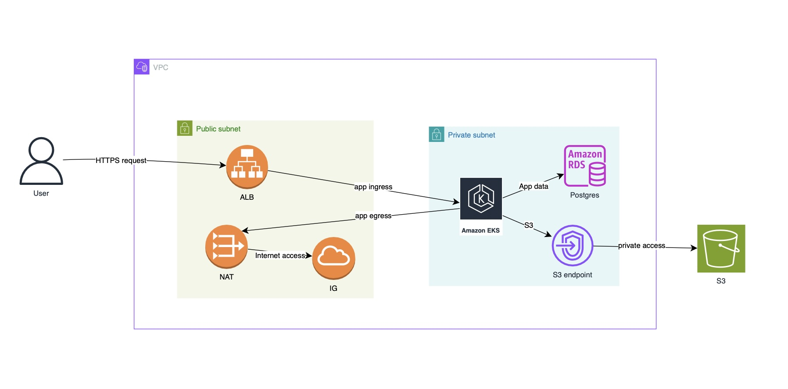

# AWS Infrastructure Setup with Terraform

## Overview

This demo project uses Terraform to provision a production ready AWS infrastructure that includes:

- Custom VPC with public/private subnets
- EKS cluster for deploying Java-based applications
- RDS PostgreSQL database (Multi-AZ)
- Application Load Balancer for routing traffic
- Secure S3 bucket with private access
- VPC Gateway Endpoint for S3



## Components

### VPC and Subnets

- **Demo CIDR Block:** `10.0.0.0/16`
- **Public Subnets:** Two subnets in different AZs for internet-facing resources like ALB and NAT Gateway.
- **Private Subnets:** Two subnets in different AZs to host EKS worker nodes and RDS securely.

### NAT Gateway

- Deployed in a public subnet.
- This allows private resources to initiate outbound internet connections for updates and package downloads.

### S3 Gateway Endpoint

- Private access to S3 from the VPC.
- Avoids traffic via public internet, enhancing security and reducing cost.

### ALB (HTTPS)

- An ALB with HTTPS listener for load balancing

### EKS

- Provisioned using available `terraform-aws-modules/eks/aws`
- Nodes deployed in private subnets.
- Managed node groups for easy orchestration.

### RDS (PostgreSQL)

- Hosted in private subnets.
- Multi-AZ setup ensures high availability.
- Encrypted and non-public.
- Access restricted to internal resources using Security Groups.

### S3 Bucket

- Private access only.
- Can be used for storing logs, backups, or artifacts.

## Getting Started

### Prerequisites

- Terraform v1.10+
- AWS CLI configured (`aws configure`)
- AWS IAM permissions
- helm CLI

### Terraform Deployment

```sh
# Initialize Terraform
terraform init

# Validate configuration
terraform validate

# Preview changes
terraform plan

# format configs
terraform fmt

# Apply the infrastructure
terraform apply

# Destroy the infrastructure
terraform destroy
```

## Template Outputs

After running apply, the following outputs will be displayed:

- ID of the created VPC
- Name of the EKS cluster
- Endpoint to access the RDS PostgreSQL instance (private access only)
- Name of the provisioned S3 bucket

These values are useful for referencing resources in future configurations or scripts.

## Security Considerations

- **Private Subnets**: EKS worker nodes and RDS instances are deployed in private subnets, inaccessible from the public internet.
- **S3 Gateway Endpoint**: Enables VPC resources to access S3 without traversing the public internet, reducing exposure and data transfer costs.
- **Security Groups**: Fine-tuned to only allow necessary traffic—RDS access is limited to EKS nodes, ALB only exposes required ports (e.g., 80/443).
- **No Public RDS Access**: The RDS instance is isolated from external traffic, accessible only through internal networking.
- **Load Balancer**: Handles all external traffic and routes it securely to internal Kubernetes services.

# Helm provisioning

## Update local Kube config to point to newly provisioned AWS EKS cluster

```sh
aws eks update-kubeconfig \
  --region us-east-1 \
  --name $(terraform output -raw eks_cluster_name)
```

- Verify the cluster resources
`kubectl get nodes`

- After verifiing the cluster details, run helm install 
`helm install java-app ./helm-app -n helm-app --dry-run`

