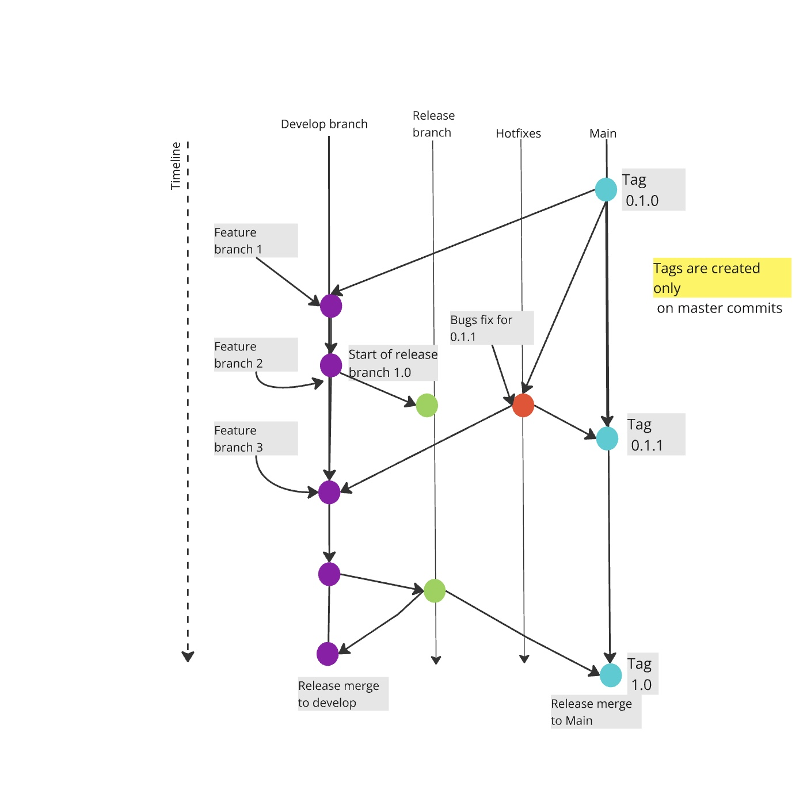

Here is the flow demonstrated in the JPG file

- This assumes Main is the golden stable. To release a feature into Main, below git-flow commands are required.
- Workflow repo should be cloned and ready to use on the workspace.
- This approach ensures features are integrated on develop, releases are merged into both main and develop, and hotfixes are patched directly into main and retracked into develop to prevent drift.




```sh
#latest repo stable checked out [git tag 0.1.0]
git checkout main 

#checkout develop version
git checkout -b develop

#checkout a feature branch from develop
git checkout -b feature-branch-1

#merge feature to develop
git checkout develop
git merge feature-branch-1

#create a release from develop (already on branch develop)
git checkout -b release-0.1.0

#merge release to main
git checkout main
git merge release-0.1.0

#merge release to develop
git checkout develop
git merge release-0.1.0

#work on a bugfix
git checkout main
git checkout -b bugfix-0.1.1

#merge bugix to main
git checkout main
git merge bugfix-0.1.1 

#merge bugix to develop
git checkout develop
git merge bugfix-0.1.1
 
